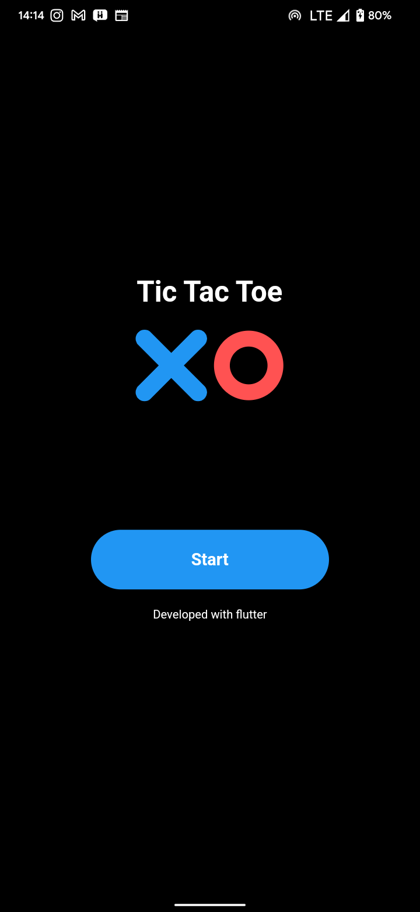
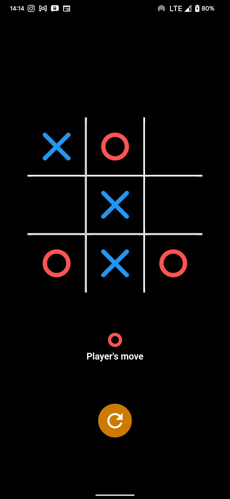
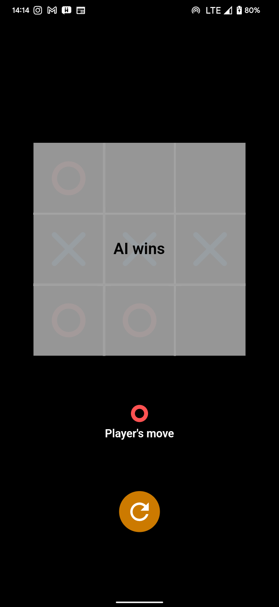

# Tic-Tac-Toe with AI

> The application is built using Flutter.

## Setup

To run the application you need to have **Flutter** installed and configured on your computer.
> Here is a guide to install flutter https://docs.flutter.dev/get-started/install

## Steps To Build 
1.) Open the project in **command line/Terminal**   
2.) Run **flutter pub get** to get all packages  
3.) Run **flutter run** to run the project  
4.) Run **flutter build apk** or **flutter build app bundle** to build the app for release.  

## App Screenshots 
<table>
    <tr>
        <td>
         
        </td>
        <td>
         
        </td>
        <td>
         
        </td>
    </tr>
</table>
